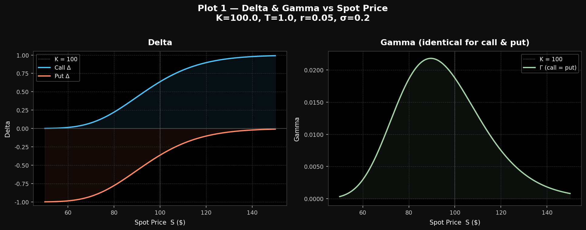
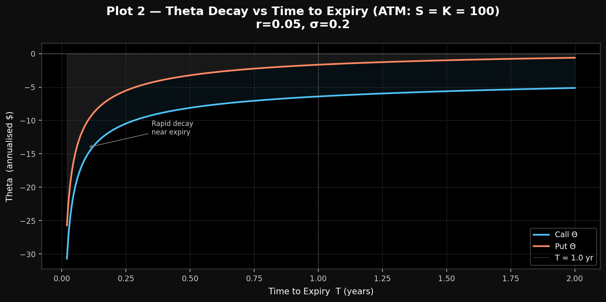
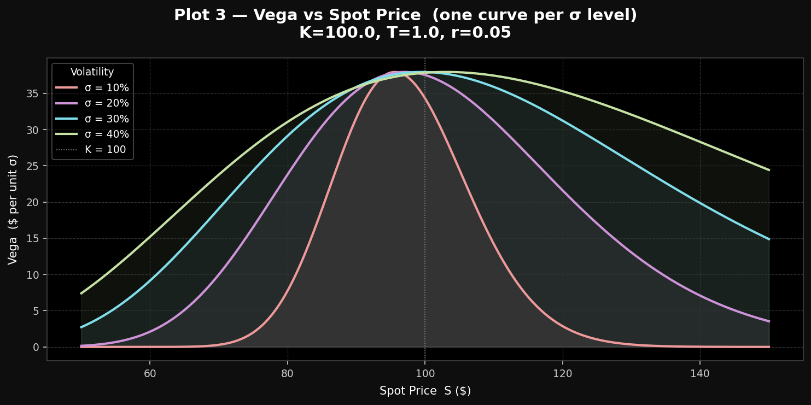
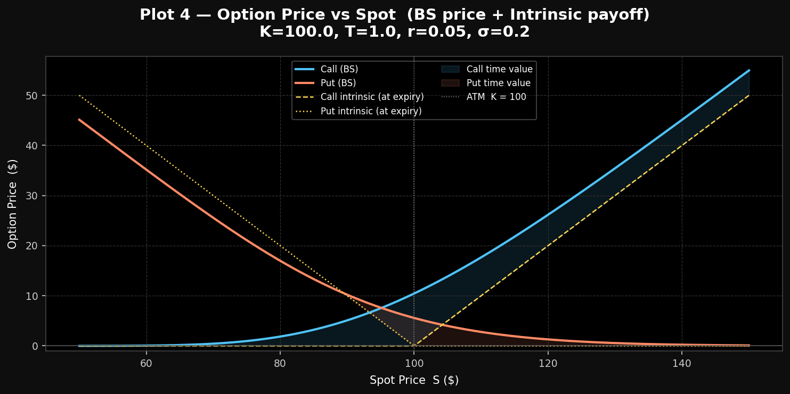
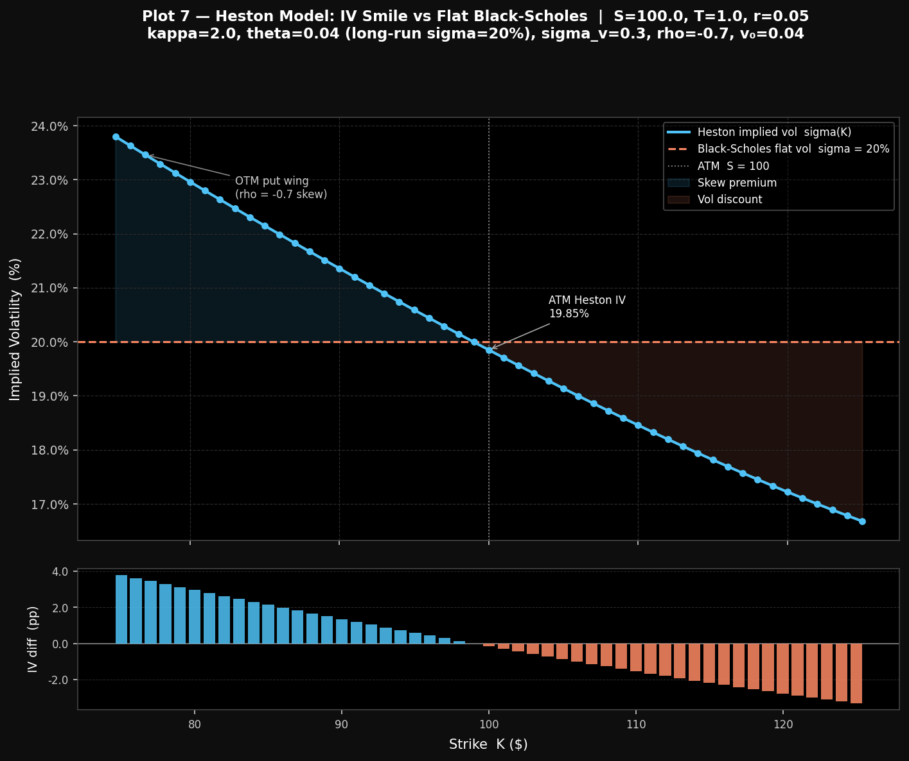
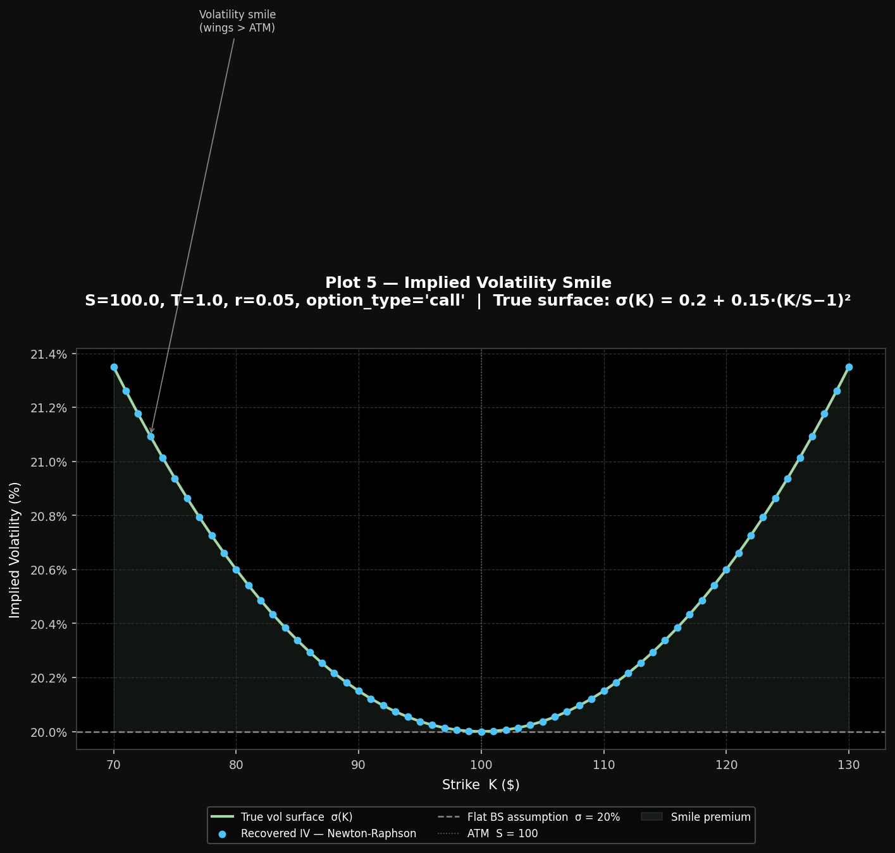
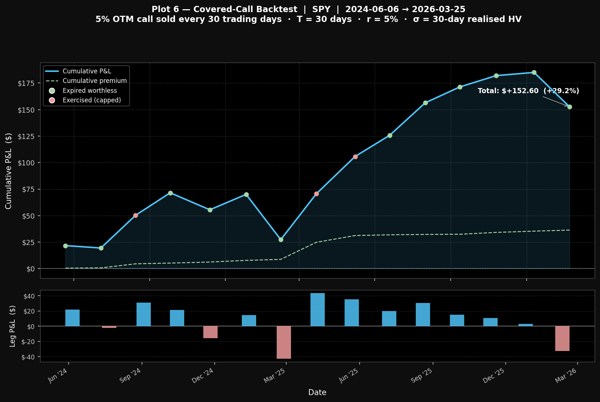
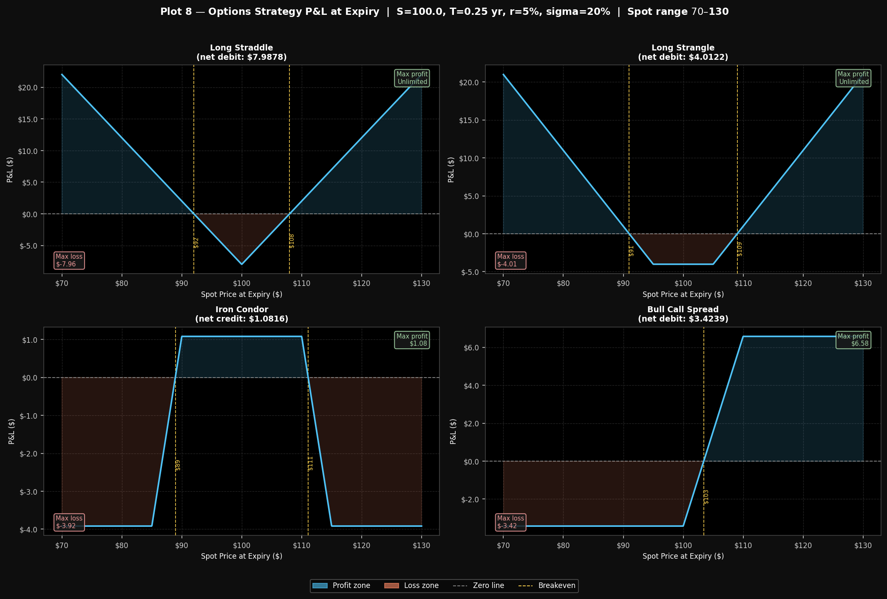

# Black-Scholes Options Pricing Engine (Python)

A pure-Python implementation of the Black-Scholes model for pricing European
vanilla options, computing all five analytical Greeks, and validating
put-call parity.

## Features

- European call & put pricing via the closed-form Black-Scholes formula
- All 5 Greeks: Delta, Gamma, Vega, Theta, Rho
- Put-call parity validation (error < 1e-10)
- Human-readable Greek interpretations
- Interactive CLI supporting multiple options per run
- Full input validation with descriptive error messages
- **Implied volatility solver** — Newton-Raphson primary + Brentq fallback
- **Greeks visualisation** — 4 diagnostic plots (dark theme, PNG output)
- **IV smile plot** — simulated vol surface with recovered implied vols
- **Covered-call backtester** — yfinance data, rolling HV, full P&L tracking
- **Heston stochastic vol pricer** — semi-analytical CF formula, IV skew vs BS
- **Strategy analyser** — 4 multi-leg strategies, breakevens, max profit/loss, 2×2 P&L grid
- **Streamlit web app** — full interactive dashboard (5 tabs, Plotly charts, dark theme)

## Requirements

```
Python >= 3.10
numpy
scipy
matplotlib
yfinance
streamlit
plotly
```

Install dependencies:

```bash
pip install -r requirements.txt
```

## How to run

### Streamlit web app (all features, interactive)

```bash
streamlit run app.py
```

Opens at `http://localhost:8501` — 5 tabs:

| Tab | Contents |
|-----|----------|
| 📊 BS Pricer & Greeks | Sidebar sliders → call/put prices, Greeks table, Delta/Gamma Plotly chart |
| 🔍 IV Solver | Market price → implied vol (NR + Brentq), IV smile across strikes 80–120 |
| 🌀 Heston vs BS | Heston params → ATM comparison table, IV skew Plotly chart, Feller check |
| 📈 Backtest | Ticker input → covered-call simulation, cumulative P&L chart, trade table |
| 🎯 Options Strategies | Strategy selector → P&L diagram, breakevens, max profit/loss metrics |

### Options pricer (Black-Scholes CLI)

```bash
python main.py
```

You will be prompted to enter the number of options to price, then for each
option:

| Parameter | Description | Example |
|-----------|-------------|---------|
| S | Current stock price | 100 |
| K | Strike price | 105 |
| T | Time to expiration (years) | 1.0 |
| r | Risk-free rate (decimal) | 0.05 |
| sigma | Volatility (decimal) | 0.20 |

## Example session

```
======================================================
    Black-Scholes Options Pricing Engine v1.0
======================================================

How many options would you like to run?
2

Enter Stock Price (S): $100
Enter Strike Price (K): $105
Enter Time to Maturity (T) in years: 1.0
Enter Risk-free Rate (r) as decimal (e.g., 0.05 for 5%): 0.05
Enter Volatility (sigma) as decimal (e.g., 0.20 for 20%): 0.20

Calculating...

======================================================
                 CALL OPTION
======================================================
Price:  $8.0214
Delta:   0.5422
Gamma:   0.0198
Theta:   -6.2771
Vega:    39.6705
Rho:     46.2015

======================================================
                 PUT OPTION
======================================================
Price:  $7.9004
Delta:   -0.4578
Gamma:   0.0198
Theta:   -1.2832
Vega:    39.6705
Rho:     -53.6776

======================================================
                     VALIDATION
======================================================
Put-Call Parity Error: 7.11e-15
Calculations verified!

======================================================
                    CALL ANALYSIS
======================================================
Delta: Good value. Reacts strongly to price changes and good for directional trades.
Gamma: Healthy value as the Delta will move noticeably. Good for trading and Gamma scalping.
Theta: Heavy time decay: Good for shorting, risky for long-term.
Vega: Medium sensitivity. Good if you expect rising uncertainty.
Rho: Big rate sensitivity. Long-term options/high strike.

======================================================
                    PUT ANALYSIS
======================================================
Delta: Moderately bearish. Balanced downside protection.
Gamma: Healthy value as the Delta will move noticeably. Good for trading and Gamma scalping.
Theta: Moderate time decay. Should only hold if you expect a move soon.
Vega: Medium sensitivity. Good if you expect rising uncertainty.
Rho: Big rate sensitivity. Long-term options/high strike.
```

### Greeks visualisation

```bash
python greeks_viz.py              # all 4 plots, interactive
python greeks_viz.py --no-show    # save PNGs only (headless / CI)
```

Generates four dark-theme plots in `plots/`:

| File | Content |
|------|---------|
| `plot1_delta_gamma.png` | Delta (call + put) and Gamma vs spot |
| `plot2_theta_decay.png` | Theta decay vs time to expiry (ATM) |
| `plot3_vega_surface.png` | Vega vs spot for σ = 10 / 20 / 30 / 40% |
| `plot4_payoff_diagram.png` | BS price vs intrinsic (time-value shading) |

### Implied volatility solver

```bash
python implied_vol.py             # interactive CLI prompt
python implied_vol.py --smile     # generate IV smile plot only
python implied_vol.py --no-show   # CLI but skip interactive display
```

#### CLI example session

```
======================================================
         Implied Volatility Solver
======================================================

Market Option Price ($): 8.50
Spot Price (S): $100
Strike Price (K): $105
Time to Maturity (T) in years: 1.0
Risk-free Rate (r) as decimal (e.g. 0.05): 0.05
Option type (call / put): call

Solving...

======================================================
                    RESULT
======================================================
Implied Volatility : 0.2087  (20.87%)
Method             : Newton-Raphson
Iterations         : 5
Price Error        : 3.41e-12
Converged          : Yes

Convergence note: Fast quadratic convergence (5 iterations).
======================================================
```

#### Using the solver as a library

```python
from implied_vol import implied_vol, plot_iv_smile
import numpy as np

# Single IV lookup
result = implied_vol(market_price=8.50, S=100, K=105, T=1.0, r=0.05, option_type='call')
print(f"IV = {result.implied_vol:.4f}  ({result.implied_vol:.2%})")
print(f"Method: {result.method}  |  Iterations: {result.iterations}")

# IV smile across strikes
K_range = np.linspace(80, 120, 41)
fig = plot_iv_smile(S=100, K_range=K_range, T=1.0, r=0.05, option_type='call', show=False)
```

#### Solver algorithm

```
1. Compute intrinsic value — raise ValueError if market_price < intrinsic
2. Newton-Raphson loop (max 100 iterations, tol = 1e-8):
       σ_{n+1} = σ_n − (BS(σ_n) − market_price) / Vega(σ_n)
   → converges in ~5 iterations for normal market conditions
3. If vega < 1e-10 or NR does not converge → fall back to Brentq
       brackets [1e-6, 10.0], xtol = rtol = 1e-10
4. Raise ValueError if Brentq cannot bracket a root
```

#### IV smile surface model

The smile plot uses:
```
σ_true(K) = σ_base + 0.15 · (K/S − 1)²
```
where `σ_base = 0.20`. This creates a symmetric quadratic smile
(higher vol for deep ITM/OTM strikes). BS prices are generated at
these vols, then IV is recovered from each price to verify the solver
round-trips accurately. The flat `σ = 0.20` assumption is shown as a
dashed reference line to illustrate the model's limitation.

### Backtester

```bash
python backtest.py          # SPY, last 2 years
python backtest.py AAPL     # any ticker
python backtest.py --no-show  # headless / CI
```

Simulates a **rolling covered-call strategy** over the last 2 years of daily price data:

| Parameter | Value |
|-----------|-------|
| Data source | yfinance (adjusted close) |
| Rebalance frequency | Every 30 trading days |
| Strike | 5% OTM  (K = S × 1.05) |
| Expiry | 30 calendar days (T = 30/365) |
| Volatility input | 30-day realised HV from log returns |
| Risk-free rate | 5% |

**P&L per leg:**
```
If S_expiry > K  (exercised) : P&L = premium + K        − S_entry
If S_expiry ≤ K  (worthless) : P&L = premium + S_expiry − S_entry
                             = premium + min(S_expiry, K) − S_entry
```

Prints a full trade-by-trade summary table and saves Plot 6.

### Options strategy analyser

```bash
python strategies.py              # full demo: 4 strategies, interactive
python strategies.py --no-show    # save PNG only (headless / CI)
```

Analyses four classic multi-leg options strategies using BS-priced premiums:

| Strategy | Legs | Bias |
|----------|------|------|
| Long Straddle | Long call + long put (same K) | Volatility long |
| Long Strangle | Long OTM call + long OTM put | Volatility long (cheaper) |
| Iron Condor | Short call/put spread (4 legs) | Range-bound / vol short |
| Bull Call Spread | Long lower call + short upper call | Moderately bullish |

**Default parameters:** S=100, r=0.05, T=0.25 yr, sigma=20%

**Output per strategy:**
- Net premium (debit / credit)
- Breakeven price(s) — linear interpolation at P&L sign changes
- Max profit and max loss (correctly distinguishes flat plateau from truly unlimited)
- P&L at S=90 / 100 / 110 spot levels
- Leg-by-leg breakdown with BS-priced premiums

**Example output:**
```
============================================================
  Options Strategy Summary
  S=100.0, r=0.05, T=0.25 yr, sigma=20%
============================================================

  ========================================================
  Strategy    : Bull Call Spread
  ========================================================
  Net Premium : $+3.4239  (debit)
  Breakeven(s): $103.42
  Max Profit  : $6.58  at S=$110.0
  Max Loss    : $-3.42  at S=$70.0
  ----------------------------------------
  P&L at S=90   : $-3.42
  P&L at S=100  : $-3.41
  P&L at S=110  : $+6.57
  ----------------------------------------
  Leg                         K   Qty    Premium
  Long call                 100    +1   $ 4.6150
  Short call                110    -1   $ 1.1911
```

**Using as a library:**
```python
from strategies import build_strategies, strategy_payoff, analyse
import numpy as np

strategies = build_strategies(S=100, r=0.05, T=0.25, sigma=0.20)
S_range = np.linspace(70, 130, 600)

for name, legs in strategies.items():
    result = analyse(S_range, legs)
    print(f"{name}: breakevens={result['breakevens']}, max_profit={result['max_profit_str']}")
```

### Heston stochastic volatility pricer

```bash
python heston.py              # full demo: ATM comparison + IV smile plot
python heston.py --no-show    # headless (save PNG, skip display)
```

Prices European options under the **Heston (1993)** stochastic volatility model
using the semi-analytical characteristic-function formula and numerical integration
(`scipy.integrate.quad`). Uses the **Albrecher et al. (2007)** numerically stable
formulation to avoid branch-cut discontinuities.

**Model dynamics:**
```
dS = r·S·dt + sqrt(v)·S·dW_S
dv = kappa·(theta − v)·dt + sigma_v·sqrt(v)·dW_v        corr(dW_S, dW_v) = rho·dt
```

**Default parameters:** S=100, K=100, T=1.0, r=0.05, v0=0.04, kappa=2.0, theta=0.04, sigma_v=0.3, rho=-0.7

| Parameter | Description | Default |
|-----------|-------------|---------|
| `v0` | Initial variance (sqrt(v0) = initial vol) | 0.04 → 20% |
| `kappa` | Mean-reversion speed | 2.0 |
| `theta` | Long-run variance (sqrt(theta) = long-run vol) | 0.04 → 20% |
| `sigma_v` | Volatility of variance (vol-of-vol) | 0.30 |
| `rho` | Spot–vol correlation (negative → equity skew) | -0.70 |

**Feller condition:** `2·kappa·theta >= sigma_v²` — checked automatically (warning if violated).

**Using as a library:**
```python
from heston import heston_price, compare_bs_heston
import numpy as np

# Single price
price = heston_price(S=100, K=100, T=1.0, r=0.05,
                     v0=0.04, kappa=2.0, theta=0.04,
                     sigma_v=0.3, rho=-0.7, option_type='call')
print(f"Heston call: ${price:.4f}")   # ~10.3942

# IV smile across strikes
K_range = np.linspace(80, 120, 41)
results = compare_bs_heston(S=100, K_range=K_range, T=1.0, r=0.05,
                             v0=0.04, kappa=2.0, theta=0.04,
                             sigma_v=0.3, rho=-0.7, show=False)
```

## Visualisations

### Plot 1 — Delta & Gamma vs Spot Price


### Plot 2 — Theta Decay vs Time to Expiry


### Plot 3 — Vega vs Spot Price (multi-sigma)


### Plot 4 — Option Price vs Spot (Payoff Diagram)


### Plot 7 — Heston Model: IV Smile vs Flat Black-Scholes


### Plot 5 — Implied Volatility Smile


### Plot 6 — Covered-Call Backtest P&L (SPY, 2 years)


### Plot 8 — Options Strategy P&L (4 strategies)


## Formula reference

### Black-Scholes price

```
d1 = [ ln(S/K) + (r + σ²/2)·T ] / (σ·√T)
d2 = d1 − σ·√T

Call = S·N(d1) − K·e^{−rT}·N(d2)
Put  = K·e^{−rT}·N(−d2) − S·N(−d1)
```

where N(·) is the standard normal CDF.

### Greeks

| Greek | Call | Put |
|-------|------|-----|
| Delta | N(d1) | N(d1) − 1 |
| Gamma | φ(d1) / (S·σ·√T) | same |
| Vega  | S·φ(d1)·√T | same |
| Theta | [−S·φ(d1)·σ/(2√T) − r·K·e^{−rT}·N(d2)] / 365 | [−S·φ(d1)·σ/(2√T) + r·K·e^{−rT}·N(−d2)] / 365 |
| Rho   | K·T·e^{−rT}·N(d2) | −K·T·e^{−rT}·N(−d2) |

where φ(·) is the standard normal PDF.

### Put-call parity

```
C − P = S − K·e^{−rT}
```

## Project structure

```
options_engine_python/
├── options_engine.py   # Core library: BS pricing, Greeks, interpretations
├── main.py             # Interactive pricer CLI
├── greeks_viz.py       # Greeks visualisation (4 plots)
├── implied_vol.py      # IV solver: Newton-Raphson + Brentq + smile plot
├── backtest.py         # Covered-call backtester (yfinance + rolling HV)
├── heston.py           # Heston SV pricer: CF formula + IV skew plot
├── strategies.py       # Multi-leg strategy analyser: payoff, breakevens, P&L
├── app.py              # Streamlit web app: 5-tab interactive dashboard
├── README.md           # This file
├── requirements.txt    # Dependencies
├── .gitignore
├── .streamlit/
│   └── config.toml     # Dark theme + headless server config
└── plots/
    ├── plot1_delta_gamma.png
    ├── plot2_theta_decay.png
    ├── plot3_vega_surface.png
    ├── plot4_payoff_diagram.png
    ├── plot5_iv_smile.png
    ├── plot6_backtest_pnl.png
    ├── plot7_heston_smile.png
    └── plot8_strategies.png
```

## Using the library directly

```python
from options_engine import price_option_pair, black_scholes, compute_greeks

# Price a pair
result = price_option_pair(S=100, K=105, T=1.0, r=0.05, sigma=0.20)
print(result.call.price)   # 8.0214
print(result.put.price)    # 7.9004
print(result.parity_error) # ~7e-15

# Or price individually
call_price = black_scholes(100, 105, 1.0, 0.05, 0.20, option_type='call')
greeks = compute_greeks(100, 105, 1.0, 0.05, 0.20, option_type='call')
print(greeks.delta, greeks.gamma, greeks.vega)
```
